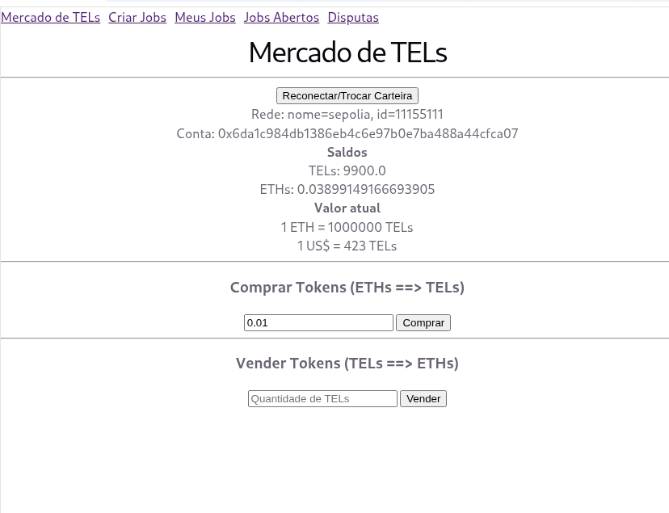
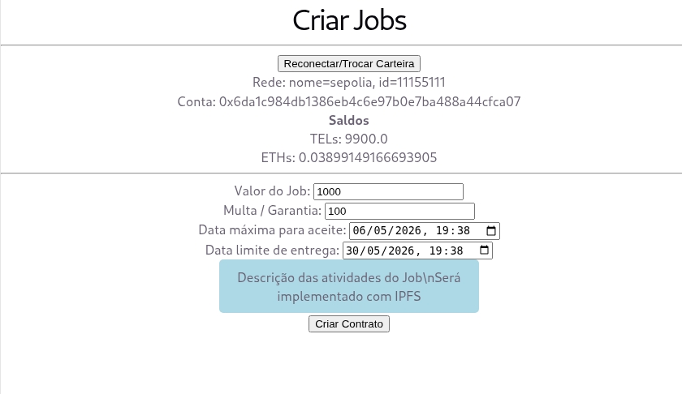
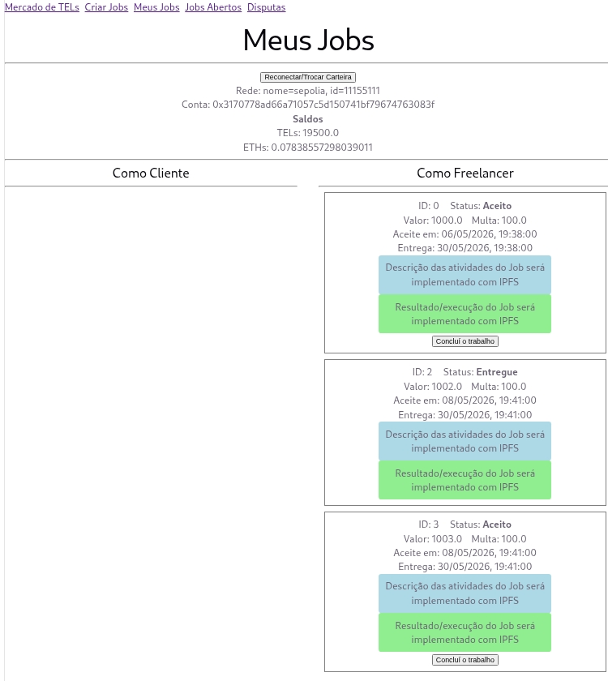
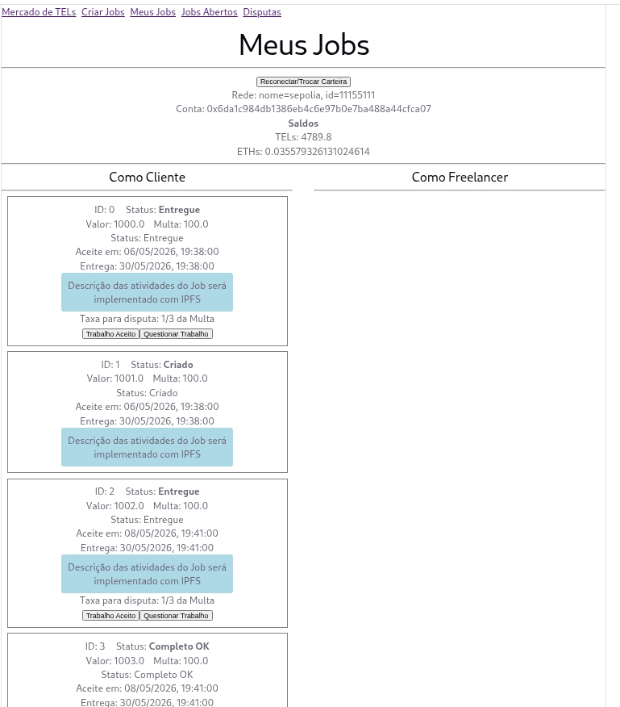
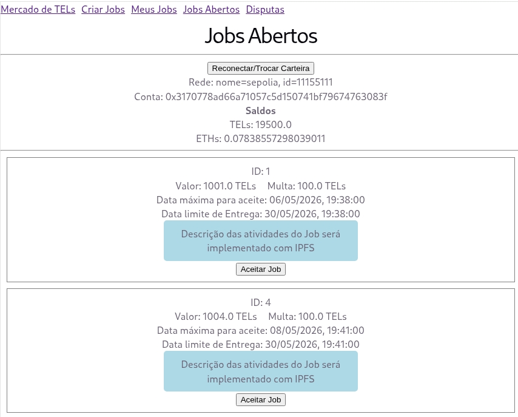
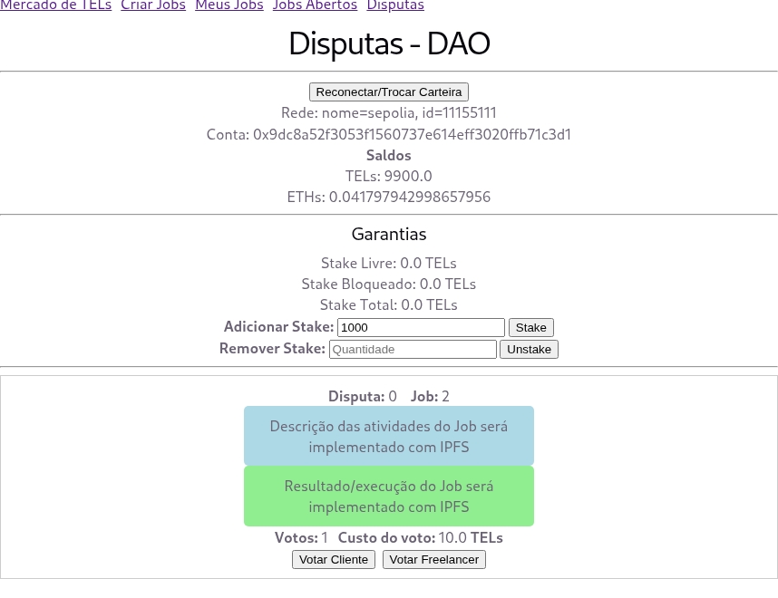

# ⚠ Disclaimer
# THE SOFTWARE IS PROVIDED "AS IS", USE AT YOUR OWN RISK
# O SOFTWARE É FORNECIDO "COMO ESTÁ", USE POR SUA CONTA E RISCO
 
## Este código foi desenvolvido com fins educacionais como tarefa de SmartContracts do curso Web 3.0  do programa de capacitação profissional, com objetivo de demostrar alguns pontos aprendidos durante o curso. Não é validado para produção nem auditado quanto às melhores práticas de codificação e segurança.

---

# Descrição
## 1. Problema que o protocolo resolve

O protocolo tem como objetivo resolver ineficiências comuns em plataformas de trabalho freelance, especialmente relacionadas à confiança entre as partes. Os principais problemas identificados são:

* Falta de confiança entre cliente e freelancer;
* Risco de não pagamento por parte do cliente;
* Risco de não entrega ou baixa qualidade por parte do freelancer;
* Dependência de sistemas centralizados para resolução de disputas.
---
## 2. Solução proposta

O sistema propõe uma arquitetura descentralizada baseada em smart contracts para garantir segurança, transparência e alinhamento de incentivos.

Principais mecanismos:

* O cliente realiza o pagamento antecipado, que fica bloqueado em um contrato (escrow) até a conclusão do trabalho;
* Um NFT representa cada contrato de trabalho, garantindo unicidade e rastreabilidade;
* Após a entrega:

  * O cliente pode aceitar o trabalho;
  * Ou abrir uma disputa;
* Disputas são resolvidas por uma DAO (organização autônoma descentralizada);
* Jurados participam via staking e são economicamente incentivados;
* Um oráculo é utilizado para conversão de valores entre tokens internos (FEELs) e USD.
---
## 3. Funcionamento do sistema

O fluxo operacional do sistema ocorre da seguinte forma:

1. O usuário acessa a plataforma via frontend conectado aos smart contracts;

2. O usuário pode adquirir tokens FEELs utilizando ETH:

   * As operações de compra e venda possuem taxa de 1% destinada ao administrador do sistema;

3. Criação de um job (cliente):

   * Define:

     * Valor do pagamento;
     * Valor da multa;
     * Prazo de entrega;
     * Prazo para aceite do job;
   * Deposita:

     * Valor total do job (escrow);
     * Taxa de 2%;

4. Aceite do job (freelancer):

   * O freelancer deve possuir tokens FEELs;
   * Deve depositar garantia equivalente à multa;

5. Possíveis cenários:

   * **Nenhum aceite:**

     * O contrato é cancelado;
     * O valor retorna ao cliente;

   * **Não cumprimento:**

     * O contrato é finalizado como “não feito”;
     * Cliente recebe pagamento + multa;

   * **Conclusão com aceite:**

     * Freelancer recebe pagamento + garantia;

   * **Conclusão com disputa:**

     * Inicia-se uma disputa (modelo melhor de 3);
     * Jurados participam depositando 10% da multa;
     * Jurados vencedores recebem recompensa proporcional;
     * O contrato é finalizado conforme decisão da DAO.

---
## 4. Arquitetura do sistema

A arquitetura do protocolo é composta pelos seguintes elementos:

* **Frontend (ethers.js):**
  Interface de interação do usuário com os contratos.

* **Smart Contracts:**

  * `Token.sol` (ERC-20 – FEELs):
    Token utilitário do sistema;

  * `TokenSale`:
    Gerencia compra e venda de FEELs por ETH;

  * `GestorDeContratoGarantido`:
    Responsável pela criação e gerenciamento dos jobs;

  * `ContractNFT` (ERC-721):
    Representa os contratos de trabalho como NFTs;

  * `DAO`:
    Responsável pela governança e resolução de disputas;

  * `Staking`:
    Gerencia garantias e participação dos jurados;

  * Oráculo (ex: Chainlink):
    Responsável pela conversão de valores (USD ⇄ FEELs).

## 5. Fluxo do sistema

O fluxo geral cobre:

* Compra e venda de tokens;
* Criação de jobs;
* Aceite por freelancers;
* Execução do trabalho;
* Tratamento de sucesso e falhas;
* Abertura e resolução de disputas via DAO;
* Distribuição de recompensas.

---
# Ambiente de Desenvolvimento Utilizado

| Software  | Versão A |
|-----------|-------|
| SO-Debian | 13,04 |
| Python    | 3.13.5 e 3.10.20 |
| nvm       | 0.39.7 |
| node      | 22.22.2 |
| **HardHat**   | **2.28.6** |

---
---

# Telas do aplicativo rodando no Sepolia

### Mercado de TELs

### Criar Jobs

### Meus Jobs

### Jobs Abertos

### Disputas
